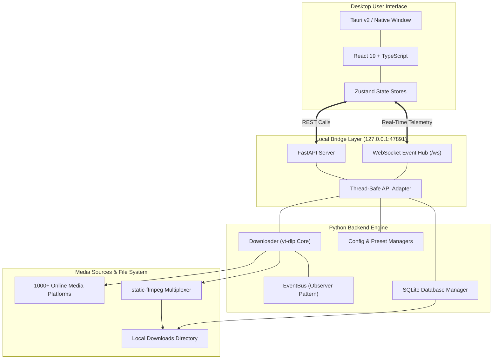

# 🎬 StreamFlow Pro — High-Performance Video & Audio Workstation

<div align="center">


[](https://github.com/mohd98zaid/StreamFlow-Pro---Advanced-Video-Audio-Downloader)
[](https://www.python.org/)
[](https://tauri.app/)
[](https://react.dev/)
[](https://www.typescriptlang.org/)
[](https://tailwindcss.com/)
[](https://fastapi.tiangolo.com/)
[](LICENSE)

**StreamFlow Pro** is an ultra-modern, production-grade media downloader and workstation for Windows. It combines a state-of-the-art **Tauri + React + TypeScript** interface with an asynchronous **Python + `yt-dlp` core engine**, orchestrated over a zero-latency local WebSocket bridge.

[Overview](#-overview) •
[Features](#-key-features) •
[Quick Start](#-quick-start) •
[Architecture](#-architectural-blueprint) •
[Launch Options](#-interactive-launcher-runbat) •
[Bridge API](#-bridge-api--websocket-protocol) •
[Testing](#-testing--quality-assurance)

</div>

---

## 🌟 Overview

StreamFlow Pro bridges the raw downloading power of Python and `yt-dlp` with the aesthetic precision, performance, and smoothness of a modern native desktop application:

* **Dark-First Modern Desktop Application:** Engineered with Tauri v2, React 19, TypeScript, and Tailwind CSS. Zero clunky UI components or retro widgets.
* **Preserved Python Core Engine:** Retains 100% of the proven multi-threaded download engine, database manager, preset engine, and event bus without breaking backward compatibility.
* **Real-Time WebSocket Synchronization:** Instantaneous, bi-directional telemetry delivering live per-download speed, progress percentages, ETA, and queue mutations directly to the UI.
* **Integrated Ad-Free Cinema Player:** Preview videos, music tracks, and label-restricted releases without ads or embed restrictions using the built-in Yuma Studio WebView player.
* **Complete Backward Compatibility:** The classic Tkinter GUI and standalone player remain fully available as selectable launch targets.

---

## ✨ Key Features

### ⚡ Download & Media Processing Engine
- **Universal Multi-Site Support:** Seamlessly downloads video and audio from over 1,000+ sources including **YouTube, Instagram (Reels & Stories), TikTok, Twitter/X, Facebook, Reddit, Pinterest, Vimeo, Dailymotion, Twitch, SoundCloud, Bilibili**, and direct **MP4/M3U8** stream links.
- **Ultra-HD Video & Lossless Audio Formats:** Download in 4K, 2K, 1080p, 720p, 480p, or extract studio-grade audio in **MP3, M4A, WAV, FLAC, AAC, and OPUS**.
- **Automated Multiplexing:** Built-in `static-ffmpeg` ensures zero-setup video and audio stream combining without requiring manual system `PATH` modifications.
- **Playlist & Batch Parsing:** Automatically extracts, displays, and batches entire channel uploads or curated playlists with customizable format presets.
- **Multi-Threaded Concurrent Queue:** Concurrently processes multiple downloads with queue reordering, pause, resume, cancel, and auto-retry resilience.

### 🎨 Modern React Desktop Interface
- **Designed for Focus:** Clean, minimal, media-first interface styled with Tailwind CSS, custom design tokens, and Lucide icons (zero emojis in UI controls).
- **Hero URL Inspector:** Fast metadata fetching with real-time video thumbnail preview, duration, channel name, view count, and available stream resolutions.
- **Interactive Live Queue:** Real-time visual progress bars, transfer speeds (MB/s), downloaded size ratios, ETA counters, and quick actions (open folder, cancel, retry).
- **YouTube In-App Discovery:** Search YouTube directly within the workstation, review video statistics, preview ad-free, and queue downloads with a single click.
- **SQLite History Vault:** Permanent, indexed local storage of all completed downloads with search, filters, pagination, file verification, and direct directory reveal.
- **Customizable Experience:** Persistent configuration for download folders, concurrent thread limits, default quality presets, auto-open behavior, and themes.

### 🎬 Yuma Studio Ad-Free Player
- **Ad-Free In-App Playback:** Preview videos and songs before or during downloads without promotional interruptions.
- **Restricted Music Compatibility:** Plays restricted music videos and VEVO tracks without encountering third-party embedding blockers.
- **Dual-View Switcher:** One-click toggle between **Cinema Mode** (minimalist distraction-free player) and **YouTube View** (comments, channel, and recommendations).
- **Instant Keyboard Shortcuts:** Press physical `Esc` to toggle fullscreen, with player controls that auto-hide after 2 seconds of inactivity.

---

## 🚀 Quick Start

### Prerequisites
- **Operating System:** Windows 10 or Windows 11 (64-bit)
- **Python:** Python 3.10+ installed and added to `PATH`
- **Node.js (Optional for development):** Node.js 18+ and npm (only needed if compiling frontend source code)
- **Rust (Optional for Tauri builds):** Cargo 1.75+ (only needed if building native `.exe` installers)

### 1. Clone the Repository
```bash
git clone https://github.com/mohd98zaid/StreamFlow-Pro---Advanced-Video-Audio-Downloader.git
cd StreamFlow-Pro---Advanced-Video-Audio-Downloader
```

### 2. Install Python Dependencies
```bash
pip install -r requirements.txt
```

### 3. Launch the Application
Simply double-click **`run.bat`** or execute it from PowerShell/CMD:
```bat
run.bat
```

The launcher will automatically detect your Python environment, activate your virtual environment if present (`venv`, `.venv`, or `env`), and display the interactive launcher menu.

---

## 🎮 Interactive Launcher (`run.bat`)

StreamFlow Pro includes a high-reliability Windows batch runner supporting interactive selection and direct command-line arguments:

```
========================================================
              StreamFlow Pro Suite
========================================================

  [1] StreamFlow Pro Modern (Tauri / React + Python) [Default]
  [2] YouTube Ad-Free Player (StreamFlow Yuma Studio)
  [3] StreamFlow Pro Classic (Legacy Tkinter GUI)
  [4] Exit

========================================================
Select an option [1-4] (Default: 1): 
```

### Command-Line Shortcuts
You can bypass the interactive menu by passing arguments directly:

| Command | Action |
| :--- | :--- |
| `run.bat modern` or `run.bat 1` or `run.bat m` | Launches modern Tauri / React interface with Python engine |
| `run.bat player` or `run.bat 2` or `run.bat p` | Launches standalone Ad-Free Yuma Studio Player |
| `run.bat classic` or `run.bat 3` or `run.bat c` | Launches legacy CustomTkinter GUI |
| `run.bat exit` or `run.bat 4` or `run.bat q` | Cleanly exits the launcher |

---

## 🏗️ Architectural Blueprint



### Dual-Layer Decoupled Design
1. **Frontend Presentation (React + TypeScript):**
   - Pure UI rendering with optimistic updates and reactive Zustand stores.
   - Communicates exclusively over localhost loopback (`127.0.0.1:47891`).
   - Zero direct file-system locks or blocking threads in the UI layer.

2. **Backend Engine (FastAPI + Python Core):**
   - Non-blocking async endpoints wrapping the underlying thread-safe `Downloader` instance.
   - The Python `EventBus` broadcasts events (`download_progress`, `download_completed`, `queue_updated`) directly across the WebSocket connection.
   - SQLite database ensures atomic, zero-corruption logging of download sessions.

---

## 🔌 Bridge API & WebSocket Protocol

The local backend engine listens strictly on `127.0.0.1:47891`. It exposes comprehensive REST endpoints and a real-time WebSocket feed:

### REST Endpoints
| Method | Route | Description |
| :--- | :--- | :--- |
| `GET` | `/api/status` | Engine heartbeat, active threads, and queue health |
| `POST` | `/api/metadata` | Extract video/playlist title, duration, thumbnail, formats |
| `POST` | `/api/download` | Add single or batch downloads to the active queue |
| `GET` | `/api/queue` | Retrieve current queue status, progress, speeds, and ETA |
| `POST` | `/api/queue/{id}/pause` | Pause active download task |
| `POST` | `/api/queue/{id}/resume` | Resume paused download task |
| `POST` | `/api/queue/{id}/cancel` | Cancel active download task |
| `POST` | `/api/queue/clear` | Clear completed/failed items from queue |
| `GET` | `/api/history` | Paginated download history with search and filtering |
| `DELETE` | `/api/history/{id}` | Delete history entry (with optional file removal) |
| `GET` | `/api/settings` | Get current user preferences and paths |
| `POST` | `/api/settings` | Save modified user preferences |
| `GET` | `/api/presets` | Get video and audio quality preset configurations |
| `POST` | `/api/search` | Search YouTube for videos and return parsed results |
| `POST` | `/api/open-folder` | Open target directory in Windows File Explorer |

### WebSocket Event Stream (`/ws`)
Upon connection, the frontend automatically subscribes to real-time events broadcast by the Python engine:
```json
{
  "event": "download_progress",
  "data": {
    "item_id": "item_1740001234",
    "url": "https://www.youtube.com/watch?v=...",
    "progress": 64.2,
    "speed": "8.4 MB/s",
    "eta": "00:24",
    "downloaded_bytes": 104857600,
    "total_bytes": 163345820
  }
}
```

---

## 📂 Project Organization

```
StreamFlow-Pro/
├── backend/                       # Python FastAPI backend & WebSocket bridge
│   ├── api_adapter.py             # Thread-safe bridge adapter to core engine
│   └── server.py                  # FastAPI server & WebSocket broadcasting
│
├── core/                          # Original Python backend engine (Untouched)
│   ├── config.py                  # Preferences and config persistence
│   ├── database.py                # SQLite history database manager
│   ├── downloader.py              # yt-dlp download orchestration
│   ├── events.py                  # EventBus implementation
│   └── models.py                  # DownloadItem, DownloadStatus data models
│
├── frontend/                      # Modern React desktop frontend
│   ├── src/
│   │   ├── components/            # UI components (Queue, History, Search, Layout)
│   │   ├── pages/                 # Main views (Download, Queue, History, Search, Settings)
│   │   ├── services/              # API and WebSocket client adapters
│   │   ├── stores/                # Zustand state stores
│   │   └── types/                 # TypeScript type definitions
│   ├── package.json               # Node dependencies & build scripts
│   └── vite.config.ts             # Vite configuration
│
├── src-tauri/                     # Tauri v2 native desktop application
│   ├── src/                       # Rust entry points (main.rs, lib.rs)
│   ├── Cargo.toml                 # Cargo dependencies
│   └── tauri.conf.json            # Window configurations & security policies
│
├── gui/                           # Legacy Tkinter interface (Preserved for compatibility)
│   ├── download_tab.py            # Classic download tab
│   ├── history_tab.py             # Classic history tab
│   ├── queue_tab.py               # Classic queue tab
│   └── main_window.py             # Classic main window
│
├── utils/                         # Utilities & shared modules
│   ├── player_process.py          # Chromium WebView2 Ad-Free Yuma Player
│   ├── presets.py                 # Video and audio preset definitions
│   ├── notifications.py           # Toast notification engine
│   └── validators.py              # URL & input format validation
│
├── docs/                          # In-depth architectural & migration documentation
│   ├── UI_MIGRATION_AUDIT.md      # Detailed migration audit and risk analysis
│   ├── TAURI_PYTHON_BRIDGE.md     # API specifications & WebSocket schema
│   ├── DESIGN_SYSTEM.md           # Color tokens, typography, and spacing rules
│   ├── FRONTEND_ARCHITECTURE.md   # Component map & state architecture
│   └── MIGRATION_STATUS.md        # 17-point feature parity matrix
│
├── tests/                         # Unit and integration test suite
│   ├── test_bridge_integration.py # Backend bridge API & WebSocket tests
│   └── test_*.py                  # Core engine unit tests
│
├── run_modern.py                  # Modern interface launcher (Backend + WebView2)
├── main.py                        # Legacy Tkinter application entry point
├── run.bat                        # Interactive Windows launcher runner
└── requirements.txt               # Python package dependencies
```

---

## 🛠️ Developer Guide

### Running in Frontend Development Mode
To work on the React frontend with Vite Hot Module Replacement (HMR):

1. **Start the Python backend:**
   ```bash
   python -c "import uvicorn; from backend.server import app; uvicorn.run(app, host='127.0.0.1', port=47891)"
   ```
2. **Start the Vite dev server:**
   ```bash
   cd frontend
   npm install
   npm run dev
   ```
   Open `http://localhost:5173` in your browser.

### Running Tauri in Development Mode
To run the full Tauri desktop shell with live frontend reloading:
```bash
cd frontend
npm run tauri dev
```

### Compiling Standalone Windows Installer (.exe)
To produce an optimized, standalone Windows binary package:
```bash
cd frontend
npm run tauri build
```
The compiled installer will be output to `src-tauri/target/release/bundle/msi/` or `nsis/`.

---

## 🧪 Testing & Quality Assurance

StreamFlow Pro includes automated unit and integration tests covering the core downloader, database operations, preset parsing, and FastAPI bridge endpoints.

Run the test suite with standard Python `unittest`:
```bash
python -m unittest discover tests
```

Expected output:
```
----------------------------------------------------------------------
Ran 14 tests in ~20s

OK
```

---

## 📄 License & Credits

Distributed under the **MIT License**. See [`LICENSE`](LICENSE) for complete terms.

### Acknowledgments
- **[yt-dlp](https://github.com/yt-dlp/yt-dlp)** for the media extraction engine.
- **[Tauri](https://tauri.app/)** & **[Rust](https://www.rust-lang.org/)** for the desktop runtime.
- **[React](https://react.dev/)** & **[Tailwind CSS](https://tailwindcss.com/)** for the user interface.
- **[Lucide](https://lucide.dev/)** for clean icons.
- **[FastAPI](https://fastapi.tiangolo.com/)** for the bridge layer.
- **[pywebview](https://pywebview.flowrl.com/)** for the ad-free cinema player window.
